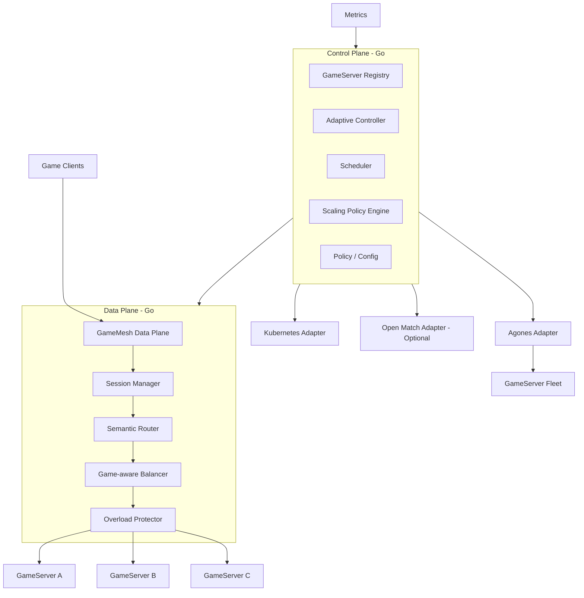

# 03. 基础架构与边界设计

## 1. 总体架构



---

## 2. 为什么拆 Data Plane / Control Plane

### Data Plane

特点：

- 处理真实玩家连接与路由；
- 高频；
- 对延迟敏感；
- 要求尽量少分配、少锁、少 RPC。

主要模块：

- Gateway；
- Session；
- Router；
- Balancer；
- Rate Limit；
- Backpressure；
- Load Shedding。

### Control Plane

特点：

- 处理秒级或亚秒级决策；
- 不直接处理每条游戏消息；
- 可以使用 RPC；
- 更关注一致性、策略、观察和调度。

主要模块：

- Registry；
- Policy；
- Autoscaler；
- Scheduler；
- Predictor；
- Kubernetes / Agones Adapter。

---

## 3. 流量路径原则

GameMesh 必须一直存在于流量路径中，而不是“高峰出现时临时启动”。

原因：

- 临时启动无法及时建立连接与状态；
- 路由状态和 Session 信息需要持续维护；
- 过载保护必须在系统已经崩溃前生效；
- 扩容只是保护动作之一，不能代替实时流量治理。

因此系统运行模式应该是：

### LOW

- Scale In；
- Consolidation；
- 降低 Ready Buffer。

### NORMAL

- 健康检查；
- Session Routing；
- Least Load / P2C；
- 基础监控。

### HIGH

- 提高 Ready Buffer；
- 扩容；
- 停止向高负载实例分配；
- 热点分片；
- 调整权重。

### OVERLOAD

- Admission Control；
- Queue；
- Rate Limit；
- 非核心功能降级；
- Load Shedding。

### EMERGENCY

- 强制拒绝低优先级流量；
- 保护核心对局；
- 大幅限制新 Match 创建；
- 仅保留必要控制通道。

---

## 4. Load Score 初步模型

第一版可以使用可解释的线性权重模型，而不是一开始上机器学习。

示例：

`LoadScore = CPU*w1 + Memory*w2 + Connection*w3 + TickLatency*w4 + Queue*w5`

注意：

- 该公式只是初始策略，不应写死；
- 不同游戏模式可配置不同权重；
- 所有指标要归一化；
- 需要防止瞬时尖峰导致抖动，可引入 EWMA；
- 负载评分只用于**新流量调度**，不直接迁移运行中 Battle。

后续可引入：

- P2C + Load Score；
- 动态权重；
- Region RTT；
- Server Warmup Penalty；
- Draining Penalty；
- Historical Failure Penalty。

---

## 5. Session 与语义一致性

GameMesh 路由至少区分三类：

### Player Affinity

同一玩家在 Session 有效期内优先回到相同 Gateway / Lobby Server。

### Party Affinity

同一 Party 在 Match 创建前保持同一逻辑上下文。

### Match Affinity

Match 一旦被分配到 GameServer，在 Match 生命周期内固定到该服务器。

因此路由不是简单：

`request -> least loaded server`

而是：

1. 是否已有 Match Binding？
2. 是否已有 Party Binding？
3. 是否需要按 Region / Version 过滤？
4. 候选 GameServer 是否 Ready / Healthy？
5. 再执行 Load Balance。

---

## 6. GameServer 状态模型

建议抽象：

- `UNKNOWN`
- `STARTING`
- `READY`
- `ALLOCATED`
- `DRAINING`
- `UNHEALTHY`
- `TERMINATED`

关键规则：

- STARTING 不接新 Match；
- READY 可分配；
- ALLOCATED 根据游戏类型决定能否继续容纳新 Room；
- DRAINING 不接新流量；
- UNHEALTHY 立即从候选池剔除；
- 已绑定 Match 不应因瞬时 LoadScore 高而被随意迁移。

---

## 7. 插件与适配器架构

### 7.1 Data Plane Extension

目标：高性能。

扩展点：

- Router Strategy；
- Balancer Strategy；
- Admission Policy；
- Priority Policy。

实现建议：

- Go Interface；
- 进程内注册；
- 启动时加载配置选择；
- MVP 不做运行时动态卸载。

### 7.2 Control Plane Plugin

目标：可插拔、可隔离。

扩展点：

- Scaling Policy；
- Prediction Policy；
- Matchmaker Adapter；
- GameServer Orchestrator Adapter。

后续可以使用：

- gRPC；
- HashiCorp go-plugin；
- 独立微服务。

### 7.3 Adapter

Adapter 不应该污染核心领域模型。

例如：

- Agones Adapter 把内部 `AllocateGameServer` 映射为 Agones Allocator 请求；
- Kubernetes Adapter 把 `ScaleGateway` 映射为 Deployment Scale / HPA 相关操作；
- Static Adapter 允许本机测试，不依赖 Kubernetes。

这样可以保证项目在开发早期就能在单机跑通。

---

## 8. MVP 部署拓扑

第一版建议：

```text
Load Generator
      |
      v
GameMesh Gateway (2~N)
      |
      v
Fake / Demo GameServer Pool
      |
      +--> gs-1
      +--> gs-2
      +--> gs-3

Metrics -> Prometheus
Control Plane -> Registry / Scheduler
```

第二阶段再升级：

```text
Kubernetes
  |
  +-- GameMesh Gateway Deployment
  +-- GameMesh Control Plane
  +-- Prometheus
  +-- Agones
      +-- Fleet
      +-- GameServer
```

这样可以把“算法正确性”和“Kubernetes 集成复杂度”拆开。

---

## 9. 一致性模型

GameMesh 不应追求所有状态强一致。

建议：

### 强约束

- 同一 Match 的最终 GameServer Binding；
- Allocation 幂等；
- Session Token 安全校验。

### 最终一致即可

- CPU；
- Memory；
- Connection Count；
- Prometheus 指标；
- Registry 部分状态；
- 扩缩容 Desired Count。

### 原因

实时系统中，如果为了一个“绝对准确的 CPU 数值”进行分布式强一致协调，代价会远高于收益。

---

## 10. 第一版技术边界

**建议第一版只解决：**

- 新连接；
- 新 Session；
- 新 Party / Match Binding；
- 新 GameServer Allocation；
- GameServer 加入 / 退出；
- Gateway Scale；
- Overload Protection。

**第一版不解决：**

- 已进行 Match 的跨服无损迁移；
- 跨 Region 强一致状态复制；
- Battle State Replication；
- 全球多活数据库。

这能让项目保持“够难，但可完成”。

